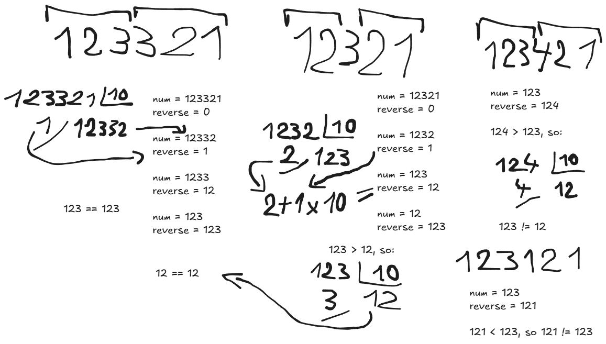

# Palindrome Number

## 🧩 Problem

Given an integer `x`, return `true` if `x` is a palindrome, and `false` otherwise.

A palindrome is a number that reads the same forward and backward.

---

## 💡 Intuition

A straightforward approach would be to convert the number into a string and compare characters from both ends.

However, this requires extra space.
Instead, we can work directly with the number and take advantage of its digits.

The key insight is that we don’t need to reverse the entire number — only half of it.

---

## ⚙️ Approach

### 🧱 Step 1: Handle edge cases

* Negative numbers are not palindromes.
* Numbers ending in `0` (but not `0` itself) cannot be palindromes.

---

### 🔄 Step 2: Reverse half of the number

We build a reversed version of the last digits:

* Extract the last digit using `% 10`
* Append it to `reverse`
* Remove the last digit from `x` using `// 10`

We repeat this until:

``x <= reverse``

At this point:

* `x` contains the first half
* `reverse` contains the reversed second half

---

### ⚖️ Step 3: Handle odd number of digits

If the number has an odd number of digits:

* `reverse` will have one extra digit (the middle one)
* We remove it by doing:

``reverse //= 10``

---

### ✅ Step 4: Compare both halves

If both halves are equal:

``return x == reverse``

---

## 🧪 Example

```
Input: 121
Output: true

Input: -121
Output: false

Input: 10
Output: false
```

---

## 🖼️ Diagram


---

## 🧮 Complexity

* **Time Complexity:** O(log X)

* **Space Complexity:** O(1)

---

## 🧾 Code

See [solution.py](solution.py)

---

## 🚀 Key Takeaways

* You don’t need to reverse the whole number.
* Reversing only half reduces space complexity to `O(1)`.
* Handling edge cases early simplifies the logic.
* This approach avoids using strings entirely.
