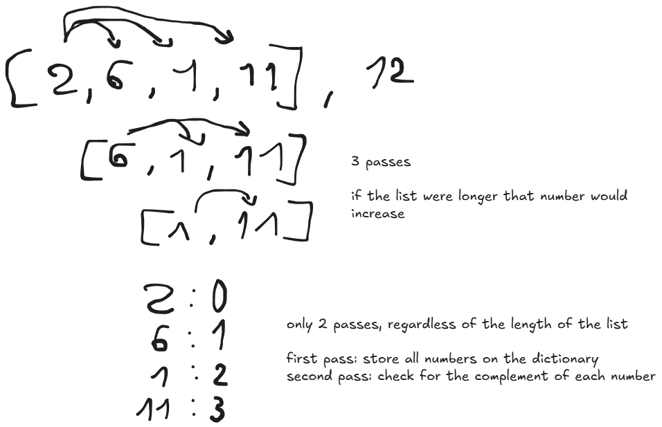

# Two Sum

## 🧩 Problem
Given an array of integers `nums` and an integer `target`, return the indices of the two numbers such that they add up to the target.

You may assume that:
- Exactly one solution exists
- You may not use the same element twice
- The order of the output does not matter

---

## 💡 Intuition
My first idea was to iterate through the list and, for each number, look for its complement (target - current number).  

However, this approach requires checking every pair, resulting in a time complexity of **O(n²)**.

---

## 🚀 Approach

To optimize the solution, I used a dictionary (hash map).

The idea is:
- Iterate through the array once
- For each number:
  - Compute its complement → `target - nums[i]`
  - Check if that complement already exists in the dictionary
  - If it exists → we found the solution
  - Otherwise → store the current number and its index

This works because dictionary lookups take **O(1)** on average, allowing us to solve the problem in linear time.

---

## ⏱️ Complexity

- **Time complexity:** O(n)  
- **Space complexity:** O(n)  

---

## 📊 Diagram

---

## 🧪 Code

See [solution.py](solution.py)